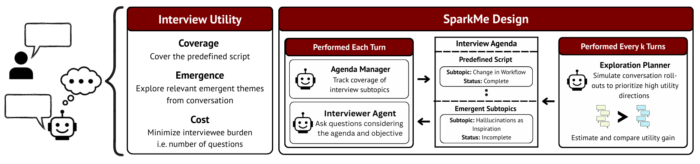

# SparkMe

<p align="center">
  
</p>

An multi-agent semi-structured interview system that conducts multi-turn interviews with strategic question planning, real-time note-taking, and emergent subtopic discovery. Supports both terminal and web interfaces.

## Setup

### Environment Variables

Create a `.env` file in the project root. Copy `.env_sample` and fill in the values:

```bash
cp .env_sample .env
```

At minimum, set your model API key (e.g., `OPENAI_API_KEY`) and review the model/directory settings.

### Python Dependencies

Recommended Python version: 3.10.12 or above

```bash
pip install -r requirements.txt
```
## Interview Topics

Interview topic configurations are in `data/configs/`. The file `data/configs/topics.json` defines the interview plan with 10 main topics and 48 subtopics covering **"Understanding the impact of AI in the workforce"** adapted from WorkBank, including areas such as background, core responsibilities, task proficiency, tech learning comfort, AI tool adoption, trust and control, and future outlook.

## Our System

The implementation for our system can be found in `src` folder.

### Terminal Mode

Run an interview session from the terminal:

```bash
python src/main.py --user_id <user_id>
```

**Arguments:**

| Flag | Description |
|---|---|
| `--user_id` | (Required) User identifier for the session |
| `--user_agent` | Use an LLM agent as the interviewee instead of terminal input |
| `--voice_input` | Enable speech-to-text for user input |
| `--voice_output` | Enable text-to-speech for interviewer responses |
| `--restart` | Clear previous session data for this user and start fresh |
| `--max_turns N` | Maximum number of conversation turns |
| `--additional_context_path` | Path to a file with additional context for the interview |

**Examples:**

```bash
# Interactive terminal interview
python src/main.py --user_id user001

# Automated with LLM user agent, capped at 50 turns
python src/main.py --user_id user001 --user_agent --max_turns 50

# With voice features
python src/main.py --user_id user001 --voice_input --voice_output
```

### Web Mode

Run the Flask web server:

```bash
python src/main_flask.py
```

Then open `http://localhost:5000` in your browser. The web interface provides:

- User authentication (register/login)
- Session creation and management
- Text and voice message support
- Real-time conversation history
- Session timeout handling (default 1 hour)

## Customization

To adapt the system for a different interview domain, three components can be modified:

### Interview Topics

Edit `data/configs/topics.json`. The file is a JSON array where each element has a `"topic"` (main category) and `"subtopics"` (list of specific areas to cover):

```json
[
    {
        "topic": "Your Topic Name",
        "subtopics": [
            "First area to explore",
            "Second area to explore"
        ]
    }
]
```

Replace the topics and subtopics to match your interview domain. The `INTERVIEW_PLAN_PATH` in `.env` points to this file.

### User Portrait

Edit `data/configs/user_portrait.json`. This is a template with empty fields that gets populated during the interview as the system learns about the interviewee. Modify the field names and structure to match the information you want to capture:

```json
{
    "Occupation": "",
    "Education/Background": "",
    "Work Context": "",
    "Your Custom Field": "",
    "Your Custom List Field": []
}
```

The `USER_PORTRAIT_PATH` in `.env` points to this file.

### Agent Prompts

Each agent has a `prompts.py` file in `src/agents/` containing its prompt templates. Modify these to change agent behavior for your domain:

| File | Controls |
|---|---|
| `src/agents/interviewer/prompts.py` | Interviewer persona, interview flow instructions, STAR framework usage |
| `src/agents/session_scribe/prompts.py` | Note-taking strategy, subtopic coverage evaluation, emergent insight detection |
| `src/agents/strategic_planner/prompts.py` | Question prioritization, rollout strategies, utility function weights |
| `src/agents/user/prompts.py` | Simulated interviewee behavior (only relevant when using `--user_agent`) |

## Baselines

Four baseline interviewer systems are provided in `baselines/`. Each takes a topic spec JSON and runs a turn-by-turn interview, supporting both human input (`--input-mode user`) and simulated LLM interviewees (`--input-mode llm`).

### InterviewGPT

**`baselines/interviewgpt/interviewgpt.py`**

A single-agent interviewer. One LLM call per turn handles both sufficiency judgment (whether the current subtopic has been adequately covered) and next question generation. Tracks condensed notes per subtopic from user responses. Logs each turn as JSONL.

```bash
python baselines/interviewgpt/interviewgpt.py \
  --spec data/configs/topics.json \
  --input-mode user \
  --max-turns 72 \
  --log logs/interviewgpt.jsonl
```

### LLMRoleplay

**`baselines/llmroleplay/llmroleplay.py`**

A single-agent system consisting of interviewer that is provided with an agenda and goes through each part of the agenda one at a time, in a particular fixed order. The agent can decide to reask for at most n times before moving on to the next subtopic.

```bash
python baselines/llmroleplay/llmroleplay.py \
  --spec data/configs/topics.json \
  --input-mode user \
  --max-turns 72 \
  --supervisor-frequency 2
```

### MimiTalk

**`baselines/mimitalk/mimitalk.py`**

An async dual-agent interviewer (interviewer + supervisor), where supervisor monitors the interviewer.

```bash
python baselines/mimitalk/mimitalk.py \
  --spec data/configs/topics.json \
  --input-mode user \
  --max-turns 72
```

### StorySage

**`baselines/storysage/`**

A multi-agent system with multiple specialized components: an interviewer agent, a session scribe for note-taking, a strategic planner, a section writer, and a session coordinator. Uses vector databases (FAISS) for question banks and session memories, enabling semantic retrieval during interviews. The most architecturally complex baseline.

```bash
cd baselines/storysage
python main.py --user_id <id> --max_turns 80
```

## UserAgent Profile Generation

You can generate the user agent personas through `dataset_gen/generate_persona_facts.py` to generate initial persona facts for each subtopic based on the WorkBank worker seed, followed by `dataset_gen/generate_bio_notes.py` to generate the profile to be fed to the user agent.

## Evaluation

Evaluation scripts are in `evaluation/`. They assess interview quality from different angles. All support `--mode` to specify which system's logs to evaluate (`sparkme`, `storysage`, `llmroleplay`, or `freeform`). Here `freeform` corresponds to either `MimiTalk` or `InterviewGPT`

### Coverage (`eval_coverage.py`)

Measures how well interview notes capture ground truth facts on a 1-5 scale (5 = all facts found explicitly, 1 = no relevant facts found). Evaluates at configurable snapshot intervals across the interview.

```bash
python evaluation/eval_coverage.py \
  --mode sparkme \
  --base-path <path-to-logs> \
  --ground-truth-path <path-to-ground-truth> \
  --num-users 200 \
  --snapshot-start 1 --snapshot-end 80 --snapshot-step 1
```

### Emergence (`eval_emergence.py`)

Detects emergent subtopics that arise during the interview beyond the original topic plan. An emergent subtopic must be genuinely new, fall within existing topics, and enable qualitatively new questions.

### Emergence Coverage (`eval_emergence_coverage.py`)

Evaluates the coverage of the emergent subtopics.

### Flow Quality (`eval_flow.py`)

Evaluates interview quality on three dimensions (each scored 1-5):

- **Coherence**: Whether consecutive questions are logically connected
- **Transition**: Smoothness of topic-to-topic transitions
- **Contingency**: Whether follow-up questions are grounded in the interviewee's prior responses

### Coverage Calculation (`calculate_coverage.py`)

Computes cumulative coverage metrics from evaluation results.
